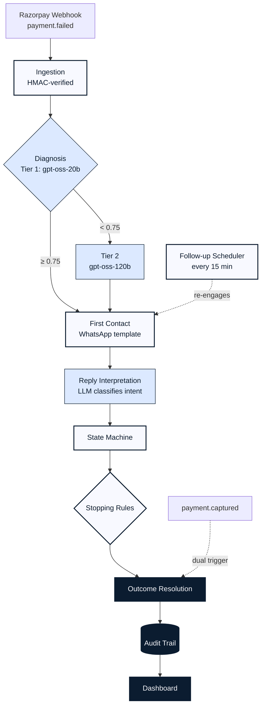

# Revenue Recovery Agent

**Razorpay AI Buildathon 2026 — AI Revenue Recovery Track**

An autonomous agent that watches for failed payments and overdue invoices, diagnoses *why* they failed, negotiates with the customer over WhatsApp until the case resolves, and proves — with real numbers, not vibes — how much of that revenue it actually got back.

Live deployment: [revenuerecoveryagent.onrender.com](https://revenuerecoveryagent.onrender.com) · Dashboard, Case Explorer, and a judge-facing live demo (**Sandbox**) all ship in this repo.

---

## 1. The Problem

A failed payment or an overdue invoice is rarely a one-shot fix. Recovering it means:

1. **Detecting** the failure the moment it happens.
2. **Diagnosing** the actual cause — insufficient funds and an expired card need completely different follow-ups.
3. **Contacting** the customer through a channel they'll actually respond on, with a message they're legally allowed to receive.
4. **Negotiating** the back-and-forth that follows — promises, questions, objections, silence.
5. **Knowing when to stop** — a runaway agent that won't take "no" for an answer is worse than no agent at all.
6. **Proving it worked**, with numbers that come from the system actually doing the work, not from the demo being scripted to succeed.

The Revenue Recovery Agent automates that entire loop: it listens for Razorpay webhooks, gets a real LLM diagnosis of the failure, reaches out over WhatsApp, interprets whatever the customer says back, and drives the case to a resolved state — recovered, retained on a paused plan, escalated to a human, or stopped — while a hard-coded rules layer keeps it from ever nagging, retrying blindly, or contacting someone who opted out.

---

## 2. What's In This Repo

| Piece | What it is |
|---|---|
| **FastAPI backend** (`core/`) | The actual recovery pipeline — webhook ingestion, diagnosis, intervention, reply classification, state machine, stopping rules, a background follow-up scheduler. |
| **Next.js dashboard** (`dashboard/`) | Three pages: a batch-metrics summary, a per-case audit-trail explorer, and a live interactive demo sandbox. |
| **Live persona harness** (`scripts/run_live_persona_harness.py`) | Drives the *real* deployed pipeline against an independent LLM playing one of six customer personas, so recovery-rate numbers are an emergent result, not a script. |
| **Batch runner** (`scripts/run_batch.py`) | A deterministic, scripted-reply batch used to measure diagnosis accuracy against hand-labeled ground truth. |
| **Alembic migrations** (`migrations/`) | Postgres schema, versioned. |

---

## 3. Architecture



*(Filled blue nodes are LLM-driven; outlined nodes are deterministic code — see §4 for why the line is drawn where it is.)*

### Two independent ways a case can resolve

A case doesn't wait for one code path to decide it's done — recovery is a race between two triggers that don't know about each other:

- **The money moves first**: Razorpay fires `payment.captured` before the customer ever replies (they used the link directly). `core/webhooks/razorpay.py`'s success-event handler jumps the case straight to `recovered`.
- **The conversation resolves first**: the customer says something the classifier reads as a completed action, and the state machine gets there before the payment webhook does.

Whichever fires first wins, and the *other* trigger arriving late is a no-op — `process_inbound_reply` explicitly checks for a terminal case status and drops any reply that arrives after resolution (saved for the record, but not re-processed).

### The follow-up scheduler — the part that makes this *proactive*, not just reactive

Every reply path in the system — the first-contact template, the reactive "thanks, here's the link" ack — is triggered by something the customer or Razorpay just did. Nothing was ever unprompted. A customer who promised to pay and then went quiet would simply sit in `promise_pending` forever, because nothing in the deployed app re-engaged them.

`core/services/followup_scheduler.py` closes that gap: a loop started from `main.py`'s FastAPI lifespan, running every `followup_scan_interval_minutes` (default 15), that finds every case still in an active status (`open`, `promise_pending`, `payment_method_required`) whose last activity — last reply, last intervention, or creation — is older than `followup_stale_hours` (default 4h), and sends each one a real `payment_reminder_followup_v1` template reminder.

---

## 4. Deterministic vs. LLM — Where I Drew the Line

**LLM-driven:**
- **Diagnosis** — every case gets a genuine call to a cheap, fast tier (`gpt-oss-20b`); low-confidence or conflicting-signal cases escalate to a reasoning tier (`gpt-oss-120b`).
- **Reply interpretation** — inbound WhatsApp text is messy free-form language; an LLM classifies it into a finite set of states.
- **Follow-up drafting** — once a customer has replied and a session is open, the LLM drafts the tone-matched, contextual response.

**Deterministic (plain Python, no LLM in the loop):**
- **First-contact messages** — Meta's WhatsApp Business policy flatly does not allow free-text business-initiated outreach outside an active session window. First contact is always a pre-approved template with parameters bound from the diagnosis, never LLM-generated text.
- **The state machine's transition table** — `promise_made → promise_pending`, `paused → retained_paused`, `opt_out → stopped`, etc. is a fixed mapping in `core/services/state_machine.py`, not something the LLM decides.
- **Stopping rules** — opt-out honoring, the max-retry cap, no-blind-retry on causes needing updated payment info, the dispute lockout, and the broken-promise escalation cap are all hard-coded in `core/services/stopping_rules.py`. None of them can be talked out of by a clever reply.
- **Idempotency & the audit trail** — webhook dedup keys, state transitions, and every outbound/inbound message are rigidly structured rows in Postgres, not something inferred after the fact.

---

## 5. The State Machine & Stopping Rules

### Case statuses

| Status | Meaning | How it's reached |
|---|---|---|
| `open` | New case, first contact not yet sent or awaiting reply | Webhook ingestion |
| `promise_pending` | Customer said they'll pay | Reply classified `promise_made` |
| `payment_method_required` | Customer needs to update a card/UPI/etc. | Reply classified `needs_new_payment_method`, or diagnosis cause is `expired_card`/`wrong_details` (no-blind-retry rule) |
| `disputed` | Diagnosis-stage cause is `dispute_raised` | `check_dispute_raised` stopping rule |
| `human_escalated` | Handed off to a human | Reply classified `disputed`, or `max_broken_promises` cap hit |
| `retained_paused` | Customer kept, subscription paused | Reply classified `paused` |
| `stopped` | Customer opted out | Reply classified `opt_out`, enforced by `check_opt_out` on every future send |
| `timeout` | Exhausted retries with no resolution | `check_max_retries` cap hit |
| `recovered` | Payment landed | `payment.captured`/`invoice.paid` webhook, terminal |

### Stopping rules (`core/services/stopping_rules.py`), checked before every outbound send

1. **Opt-out gate** — a `stopped` case never gets contacted again, full stop.
2. **Max-retry cap** (3) — cold outreach that's gone unanswered 3 times escalates to `timeout`. Deliberately skipped once the customer is actively replying (an engaged conversation isn't "unanswered").
3. **No-blind-retry** — `expired_card` / `wrong_details` causes can't be fixed by resending the same request; the case is redirected to `payment_method_required` instead of retried blindly.
4. **Dispute lockout** — a `dispute_raised` cause blocks all further automated contact immediately.
5. **Broken-promise cap** (3) — a customer can say "I'll pay later" exactly so many times before the agent stops taking their word for it and hands off to a human instead of looping on the same promise forever.

---

## 6. The Dashboard

Three pages, all reading live from the same Postgres database the backend writes to:

- **Batch Summary** (`/`) — headline recovery metrics pulled from the real `cases`/`outcomes` tables (excluding sandbox `test_*` traffic), plus the persona-simulation outcome breakdown as a stacked chart and the frozen ground-truth diagnosis-accuracy numbers.
- **Case Explorer** (`/explorer`) — every real case with its full audit timeline: diagnosis reasoning, every message sent and received, every state transition, every stopping rule that fired — reconstructed entirely from the append-only `AuditEvent` log.
- **Live Interaction / Sandbox** (`/sandbox`) — a judge-facing live demo. Pick a persona, a failure type, and a root cause; the backend fires a real synthetic Razorpay webhook, runs the *actual* diagnosis → intervention → reply-classification → state-machine pipeline against a `test_*`-prefixed synthetic customer, with a second independent LLM (Cerebras) improvising that persona's replies in real time. What you're watching is the production pipeline, not a mock.

---

## 7. Setup Instructions

Python 3.12+ (FastAPI) and Node/Next.js. Clean-clone instructions:

```bash
# 1. Clone
git clone https://github.com/OFF-rtk/RevenueRecoveryAgent.git
cd RevenueRecoveryAgent

# 2. Python environment
python3 -m venv .venv
source .venv/bin/activate
pip install -e ".[dev]"

# 3. Configure environment
cp .env.example .env
# Fill in GROQ_API_KEY (diagnosis + reply classification) and, if you want
# to run the live persona demo/harness, CEREBRAS_KEY (not in .env.example --
# it powers the *persona's* replies, a separate LLM from the agent itself).
# WHATSAPP_* vars are only required for real Meta Cloud API sends; the
# sandbox and batch runner work against MockChannel/synthetic webhooks
# without them.

# 4. Database
docker-compose up -d db
alembic upgrade head

# 5. Backend
.venv/bin/uvicorn core.main:app --reload --port 8001

# 6. Dashboard (new terminal)
cd dashboard
npm install
npm run dev
```

### Exercising it without live WhatsApp

- **Sandbox demo**: open the dashboard's Live Interaction tab, or `POST /api/sandbox/run` directly — runs the full pipeline against a synthetic customer, no real WhatsApp account needed.
- **Diagnosis-accuracy batch**: `.venv/bin/python scripts/run_batch.py --count 65 --seed 42` — deterministic, scripted replies, `MockChannel` only.
- **Live persona harness**: `.venv/bin/python scripts/run_live_persona_harness.py` — runs against a deployed instance's real HTTP endpoints, with an independent LLM playing each persona.

---

## 8. Testing & Persona Simulation

Recovery rate is only an honest number if the outcome isn't decided in advance. Instead of a scripted batch, the live persona harness runs the real, deployed diagnosis + conversation pipeline against a *separate* LLM (Cerebras) simulating six distinct customer personas — each given a *tendency*, not a scripted ending, at randomized temperature (0.7–0.9) so behavior genuinely varies case to case.

Full methodology, configuration, and complete per-persona results: **[batch_test.md](batch_test.md)**.

### The personas

1. **Accidental Failure** — straightforward, pays quickly once the issue is explained.
2. **Needs Payment Help** — willing to pay, but needs a working alternative (e.g. UPI) after a card issue.
3. **Suspicious Payer** — asks clarifying questions before paying; won't fabricate trust.
4. **Considering Cancellation** — genuinely ambivalent about keeping the subscription.
5. **Forgetful Promises Then Pays** — commits to paying later, needs a real reminder to actually convert.
6. **Ignores Completely** — never responds; tests the no-reply → escalation path.

### Results — 50-case live run against the deployed instance

| Outcome | Count | Rate |
|---|---|---|
| Recovered (paid) | 22 | 44.0% |
| Retained via pause | 12 | 24.0% |
| Escalated to human | 7 | 14.0% |
| Timed out (no resolution) | 9 | 18.0% |

### Per-persona breakdown

| Persona | Cases | Recovered | Retained | Escalated | Timeout |
|---|---|---|---|---|---|
| Accidental Failure | 8 | 100.0% | — | — | — |
| Needs Payment Help | 10 | 100.0% | — | — | — |
| Forgetful Promises Then Pays | 7 | 57.1% | — | — | 42.9% |
| Considering Cancellation | 13 | — | 92.3% | 7.7% | — |
| Suspicious Payer | 6 | — | — | 100.0% | — |
| Ignores Completely | 6 | — | — | — | 100.0% |

A few things worth calling out:

- **`considering_cancellation` mostly resolves to a retained pause, not a lost customer.** The negotiation prompt deliberately doesn't let ambivalence collapse into an immediate concession — the agent offers a pause and surfaces real value first, and only stops contacting someone if they explicitly and unambiguously opt out.
- **`suspicious_payer` converts at 0% — and that's the point.** When asked for account details the agent genuinely doesn't have (a signup date, a receipt), it declines to fabricate an answer and escalates to a human instead. Every one of its 6 cases ends in a correct human escalation, not a hallucinated close.
- **The two personas with no underlying reason to refuse (`accidental_failure`, `needs_payment_help`) converted at 100%.** Expected — the agent doesn't need to work hard to close a case that was never adversarial.

### Diagnosis accuracy — separate ground-truth batch (65 hand-labeled cases)

| Metric | Value |
|---|---|
| Diagnosis accuracy | 93.8% (61/65) |
| Resolved on cheap tier (gpt-oss-20b) | 87.7% (57/65) |
| Escalated to reasoning tier (gpt-oss-120b) | 12.3% (8/65) |
| Escalation recall (hand-authored ambiguous cases) | 8/10 |

This batch is deliberately separate from the persona-simulation run: it measures whether the diagnosis layer identifies the *right cause*, using scripted replies for determinism, so tier-routing and accuracy can be graded against a fixed ground truth rather than an emergent conversation.

---

## 9. What I Learned Building This

Building an agent that directly texts real customers surfaces failure modes that don't show up as crashes — they show up as something that *looks* correct and isn't.

- **The WhatsApp session-window discovery.** I originally had the LLM craft the very first outbound message. Meta blocks free-text business-initiated messages outside an active 24-hour session — full stop, no exceptions. First contact had to become a deterministic, parameter-bound template; LLM generation is reserved for replies *after* the customer opens a session by responding.

- **The WABA subscription bug.** Outbound sends worked; inbound replies never reached my webhook, despite a verified callback URL and the `messages` field correctly toggled in the dashboard. The real cause was one layer deeper — my app was never registered as a *subscribed app* on the WhatsApp Business Account itself, a separate API-level subscription from anything visible in the dashboard. Found by querying `/{WABA_ID}/subscribed_apps` directly and discovering only Meta's own default test app was subscribed. One POST to the same endpoint fixed it — the hardest bug to find precisely because everything *looked* fully configured.

- **The tier-1-model-confidently-wrong problem.** The obvious way to decide when a cheap diagnosis model should escalate to a bigger one is to just ask it: "rate your confidence, zero to one." That doesn't work — small models are bad at grading their own reasoning honestly, and will happily report high confidence even when the underlying logic is shaky. Confidently wrong is worse than honestly unsure, because nothing downstream catches it. The fix was to stop asking for a number at all: `prompts/diagnosis_v1.txt` forces a mandatory three-step reasoning chain first — what does the raw error indicate, does the context conflict with it, is there genuine ambiguity — and confidence is mechanically derived from that last answer, never self-reported. A clean match gets 1.0; any flagged conflict is forced under the 0.75 escalation threshold automatically, no matter how sure the model claims to be.

- **The suspicious 100% accuracy catch.** An early ground-truth batch reported 100% diagnosis accuracy with 0% of cases escalating to the reasoning tier. That combination was the red flag, not the good news — it meant the fixtures weren't testing any real ambiguity. I rebuilt the fixture set with genuinely conflicting-signal cases and, in the process, found and removed an overfitted prompt rule that mechanically forced low confidence whenever one specific context field was populated — a rule that happened to correlate perfectly with my own fixture file's structure, not with any real reasoning about the case.

- **The sandbox's own "one turn too many" bug.** The live-demo round loop tracked whether the customer's last message had already been "seen" to decide when to end a simulation. When a reply resolved the case as a side effect of *itself* (a `pay_now` reply immediately followed by the payment webhook, or a broken-promise reply that tripped the escalation rule mid-processing), the auto-generated handoff message that came with it was a brand-new, technically-"unseen" row — so the loop called the persona *one more time* after the conversation was already over. That extra reply got saved to the database but never got an audit trail (the backend's own terminal-case guard silently drops it), so it was invisible everywhere except a raw table scan. Fixed by having the loop re-check the case's actual resolved status directly, instead of inferring it from what messages it had already displayed — and by discovering, along the way, that the naive fix for this had its own bug: SQLAlchemy's identity map handed back a stale, pre-webhook copy of the same case object until the query was forced to `populate_existing()`.

- **The missing proactive half of the system.** Every reminder that ever went out was reactive — triggered by an inbound message or a manually-run script. A customer who promised to pay and then went silent had nothing that would ever check back in. The follow-up scheduler (§3) exists because "the agent negotiates well when spoken to" and "the agent actually re-engages someone who's gone quiet" turned out to be two different claims, and only the code proves the second one.

The pattern across all of these: the bugs that mattered weren't the ones that crashed loudly. They were the ones where a clean-looking metric, a fully-configured dashboard, or a helpful-sounding reply was quietly wrong underneath. Catching them meant treating my own good-looking numbers with the same skepticism as a broken one.
